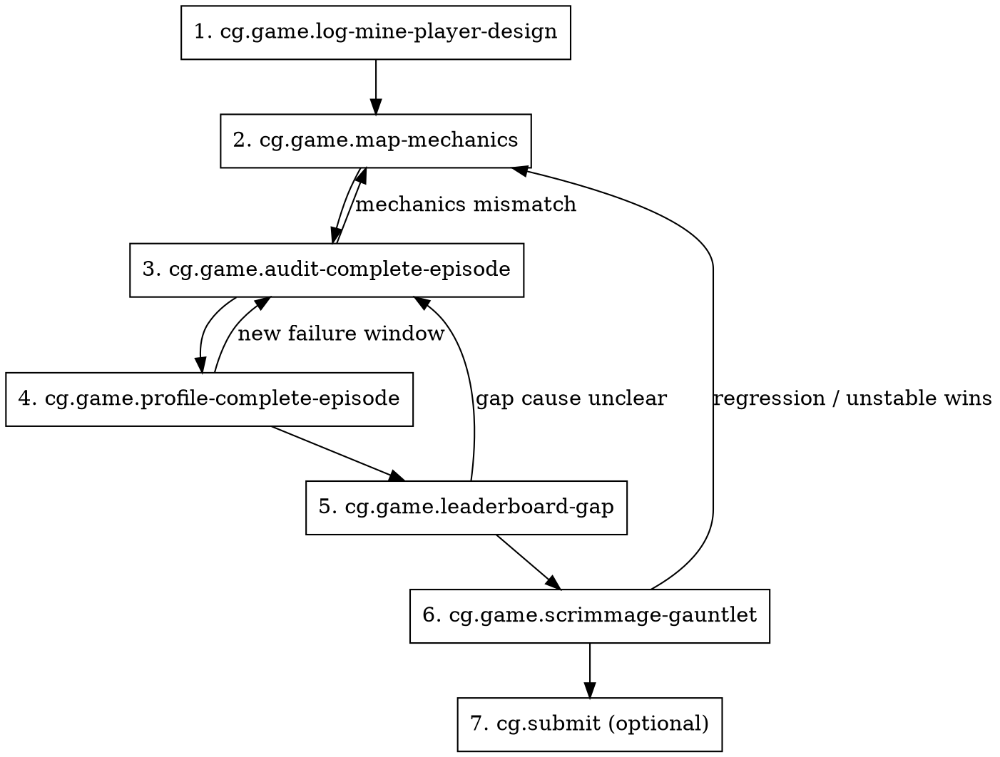

# Build Player

## Overview

This is the meta-skill for making a strong CoGames player. It composes the focused `cg.game.*` skills into one loop that
starts with prior-art mining and ends with a local gauntlet that is strong enough to justify upload.

This is the player/policy branch of the `cg.game` suite. Use it after the mission rules are stable. If the work is
really about creating a new game or overhauling game mechanics/content, start with `cg.game.new-game` or
`cg.game.build-game` instead. Use it once the game package already runs and the remaining risk is policy quality rather
than game definition.

**Announce at start:** "I’m running the full player-build loop: mine prior work, map mechanics, audit and profile full
episodes, close the leaderboard gap, then clear the scrimmage gauntlet."

## The Process

## Steps

1. Mine local and SSH logs first. Pull forward proved ideas, failed experiments, reused scripts, and benchmark targets.
2. Write the mechanics contract and invariants before changing the player.
3. Audit complete episodes on multiple seeds until you can point at the first concrete failure window.
4. Profile complete episodes and correlate hotspots with behavioral waste.
5. Build a leaderboard-gap table against the best baselines.
6. Run the scrimmage gauntlet until the player clears the local bar without regressions.
7. If the user wants the live tournament step, hand off to `cg.submit`.

## Quick Reference

| Phase        | Skill                              | Main output                     |
| ------------ | ---------------------------------- | ------------------------------- |
| Prior art    | `cg.game.log-mine-player-design`   | reused findings and dead ends   |
| Mechanics    | `cg.game.map-mechanics`            | contract and invariants         |
| Audit        | `cg.game.audit-complete-episode`   | evidence-backed failure windows |
| Profile      | `cg.game.profile-complete-episode` | hotspots and timeout sources    |
| Gap analysis | `cg.game.leaderboard-gap`          | ranked baseline deltas          |
| Validation   | `cg.game.scrimmage-gauntlet`       | promotion or rejection decision |

## Integration

**Uses:** `cg.game.log-mine-player-design`, `cg.game.map-mechanics`, `cg.game.audit-complete-episode`,
`cg.game.profile-complete-episode`, `cg.game.leaderboard-gap`, `cg.game.scrimmage-gauntlet`

**Pairs with:** `cg.submit`, `cg.test`, `tr.cogames-command`
